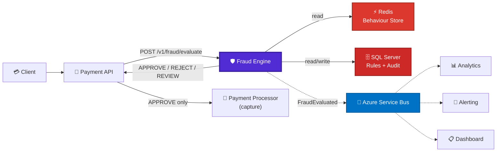
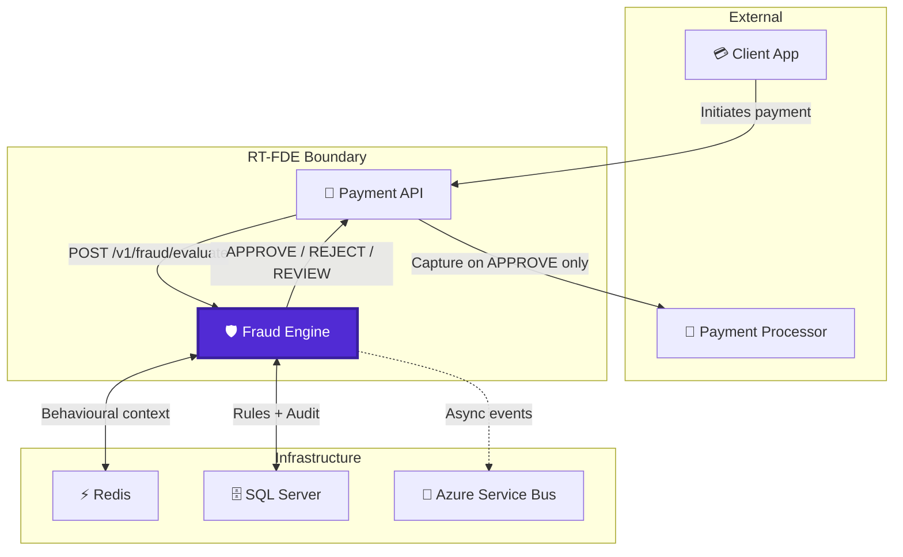
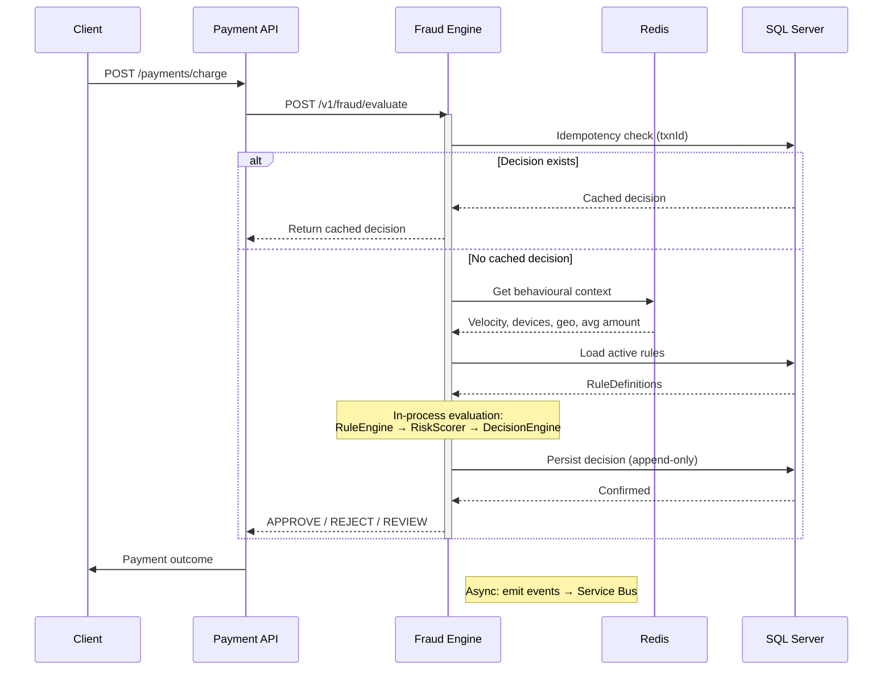
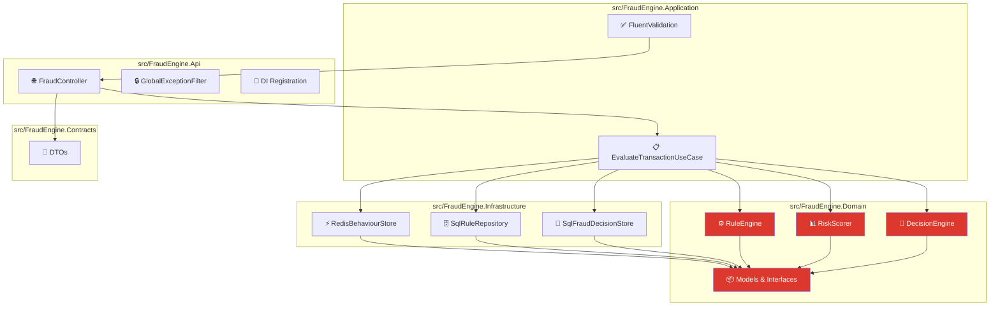
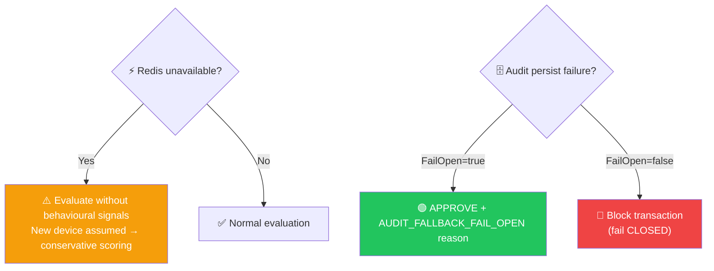
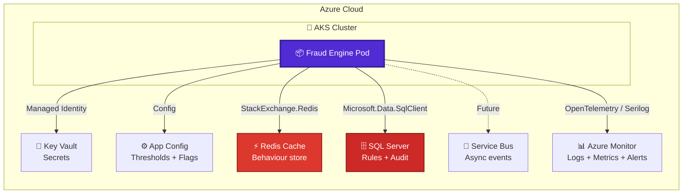
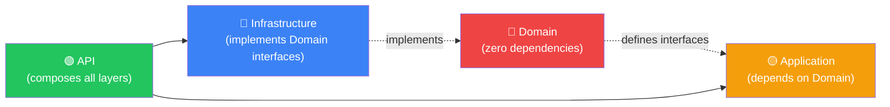

<div align="center">


[](tests/FraudEngine.Unit/)
[](coverage-report/Summary.txt)
[](tests/FraudEngine.Load/fraud-engine-load.js)
[](src/FraudEngine.Api/)

</div>

---

# RT-FDE — Real-Time Fraud Detection Engine

> **Every financial decision is *explainable*, *consistent*, and *safe under failure* — not just "fraud is blocked".**

RT-FDE is a synchronous risk assessment service that intercepts payment transactions at the **Authorised → Captured** transition and returns a scored, explainable decision before capture is allowed to proceed. Built for payment platforms that need **sub-200ms fraud verdicts** with full **POPIA-aligned** compliance auditability.

<div align="center">



</div>

---

## Table of Contents

- [Quick Start](#quick-start)
- [Architecture](#architecture)
  - [System Context](#system-context)
  - [Critical Path Data Flow](#critical-path-data-flow)
  - [Component Layering](#component-layering)
- [Decision Pipeline](#decision-pipeline)
- [API Contract](#api-contract)
- [Configuration](#configuration)
- [Failure Handling](#failure-handling)
- [Infrastructure](#infrastructure)
- [Testing](#testing)
- [Observability](#observability)
- [Development](#development)
- [Deployment](#deployment)
- [Design Decisions](#design-decisions)
- [Open Questions](#open-questions)

---

## Quick Start

```bash
# 1. Clone
git clone https://github.com/your-org/RT-FDE.git && cd RT-FDE

# 2. Build
dotnet build

# 3. Run tests
dotnet test tests/FraudEngine.Unit/

# 4. Run the API locally (uses stub infrastructure by default)
UseRealInfrastructure=false dotnet run --project src/FraudEngine.Api/

# 5. Send a test request
curl -X POST http://localhost:5000/v1/fraud/evaluate \
  -H "Content-Type: application/json" \
  -d '{
    "transactionId": "'$(uuidgen)'",
    "userId":        "'$(uuidgen)'",
    "amount":        2500.00,
    "currency":      "ZAR",
    "timestamp":     "'$(date -u +%Y-%m-%dT%H:%M:%SZ)'",
    "ipAddress":     "192.168.1.1",
    "deviceId":      "device-a1b2c3",
    "merchantId":    "MERCH-001"
  }'
```

---

## Architecture

### System Context



### Critical Path Data Flow



### Component Layering



**Key principle:** Domain and Application layers have **zero infrastructure dependencies**. All infrastructure is injected via interfaces defined in the Domain layer.

---

## Decision Pipeline

```mermaid
flowchart LR
    Txn["📥 Transaction"] --> Idem{"🔍 Idempotent?"}
    Idem -->|Yes| Cache["📋 Return cached decision"]
    Idem -->|No| Redis["⚡ Fetch behaviour"]
    Redis -->|Unavailable| Degrade["⚠️ Degraded mode"]
    Redis -->|Available| Rules["📜 Load rules"]
    Degrade --> Rules

    Rules --> Eval["⚙️ RuleEngine"]
    Eval -->|"HIGH_AMOUNT_ANOMALY +30"| Score
    Eval -->|"HIGH_VELOCITY +25"| Score
    Eval -->|"GEO_ANOMALY +25"| Score
    Eval -->|"NEW_DEVICE +20"| Score

    Score["📊 RiskScorer<br/>Σ deltas, cap 100"] --> Decision{"🎯 DecisionEngine"}

    Decision -->|"0–39"| Approve["✅ APPROVE"]
    Decision -->|"40–69"| Review["🔶 REVIEW"]
    Decision -->|"70–100"| Reject["❌ REJECT"]

    Approve --> Persist["💾 Persist audit"]
    Review --> Persist
    Reject --> Persist
    Persist --> Events["📨 Emit Service Bus events"]

    style Approve fill:#22c55e,color:#fff
    style Review fill:#f59e0b,color:#fff
    style Reject fill:#ef4444,color:#fff
```



### V1 Rules

| Rule | Condition | Score Delta |
|------|-----------|-------------|
| **Amount anomaly** | `amount > user_avg × 3` | +30 |
| **Velocity breach** | transactions in last 60s > 5 | +25 |
| **Geo anomaly** | geo distance > 1000km in < 1hr | +25 |
| **New device** | `deviceId` NOT in known devices | +20 |

Rules are **additive** — all matching rules fire and their deltas are summed, then capped at 100.

---

## API Contract

### Request

```
POST /v1/fraud/evaluate
```

```json
{
  "transactionId": "550e8400-e29b-41d4-a716-446655440000",
  "userId":        "6ba7b810-9dad-11d1-80b4-00c04fd430c8",
  "amount":        2500.00,
  "currency":      "ZAR",
  "timestamp":     "2026-04-08T12:00:00Z",
  "ipAddress":     "192.168.1.1",
  "deviceId":      "device-a1b2c3",
  "merchantId":    "MERCH-001",
  "latitude":      -26.2041,
  "longitude":     28.0473
}
```

| Field | Required | Type | Notes |
|-------|----------|------|-------|
| `transactionId` | ✅ | UUID | Used for idempotency |
| `userId` | ✅ | UUID | Links to behavioural context |
| `amount` | ✅ | decimal | Must be > 0 |
| `currency` | ✅ | string | 3-char ISO code |
| `timestamp` | ✅ | ISO8601 | Transaction timestamp |
| `ipAddress` | ✅ | string | — |
| `deviceId` | ✅ | string | Device fingerprint |
| `merchantId` | ✅ | string | — |
| `latitude` | ❌ | double? | Geo anomaly rule |
| `longitude` | ❌ | double? | Geo anomaly rule |

### Response

```json
{
  "decision":  "REJECT",
  "riskScore": 87,
  "reasons":   ["HIGH_VELOCITY", "NEW_DEVICE"]
}
```

| Field | Type | Notes |
|-------|------|-------|
| `decision` | string | `APPROVE`, `REVIEW`, or `REJECT` |
| `riskScore` | int | 0–100 |
| `reasons` | string[] | All matched rule reasons |

### Error Response

```json
{
  "error": "An internal error occurred.",
  "correlationId": "0HN7ABC..."
}
```

---

## Configuration

All thresholds are **configuration-driven** — never hardcoded in code.

```json
{
  "FraudThresholds": {
    "ReviewThreshold": 40,
    "RejectThreshold": 70
  },
  "RuleEvaluationThresholds": {
    "AmountAnomalyMultiplier": 3.0,
    "HighAmountAbsoluteThreshold": 50000,
    "MaxTransactionsPer60s": 5,
    "MaxGeoDistanceKm": 1000
  },
  "FailBehaviour": {
    "FailOpen": false
  }
}
```

| Setting | Default | Description |
|---------|---------|-------------|
| `FraudThresholds.ReviewThreshold` | 40 | Score at which decisions become REVIEW |
| `FraudThresholds.RejectThreshold` | 70 | Score at which decisions become REJECT |
| `RuleEvaluationThresholds.AmountAnomalyMultiplier` | 3.0 | Multiplier above average that triggers HIGH_AMOUNT_ANOMALY |
| `RuleEvaluationThresholds.MaxTransactionsPer60s` | 5 | Max txns per 60s before HIGH_VELOCITY |
| `RuleEvaluationThresholds.MaxGeoDistanceKm` | 1000 | Max km before GEO_ANOMALY fires |
| `FailBehaviour.FailOpen` | `false` | `true` = allow on audit failure; `false` = block |

**Secrets** (connection strings, signing keys) come from **Azure Key Vault** — never in source control or committed config files.

---

## Failure Handling



| Failure | Behaviour |
|---------|-----------|
| **Redis unavailable** | Evaluate without behavioural signals; treat as unknown/new device; proceed with conservative scoring |
| **Engine timeout** (caller-side) | Configuration-driven: fail **CLOSED** (block) or **OPEN** (allow). Production default: CLOSED |
| **Duplicate `transactionId`** | Return cached decision immediately — no re-evaluation |
| **Audit write fails** | Surface error; block if fail CLOSED; allow with `AUDIT_FALLBACK_FAIL_OPEN` reason if fail OPEN; alert on-call |

---

## Infrastructure



### Environments

| Environment | Purpose | Notes |
|-------------|---------|-------|
| `local` | Developer machines | Docker Compose; Redis + SQL Server in containers |
| `dev` | Continuous integration | Deployed on every merge to `main` |
| `staging` | Pre-production validation | Production parity; used for load tests |
| `production` | Live traffic | Fail CLOSED on timeout; full audit enabled |

### Health Checks

| Endpoint | Probe Type | Purpose |
|----------|-----------|---------|
| `/health/live` | Liveness | Process is alive |
| `/health/ready` | Readiness | Dependencies (Redis, SQL) reachable |

### Redis Key Convention

All keys follow the pattern: `noun:{id}:descriptor:window`

| Key | Purpose |
|-----|---------|
| `user:{id}:txn_count:1min` | Velocity tracking |
| `user:{id}:last_ip` | IP change detection |
| `user:{id}:devices` | Known device set |
| `user:{id}:last_lat` | Last known latitude |
| `user:{id}:last_lon` | Last known longitude |
| `user:{id}:avg_amount` | Average transaction amount |

---

## Testing

### Unit Tests (xUnit)

```bash
dotnet test tests/FraudEngine.Unit/
```

| Test Class | Coverage | What It Validates |
|------------|----------|-------------------|
| `RuleEngineTests` | 16 tests | Every rule fires on matching input and stays silent on non-matching input |
| `RiskScorerTests` | 4 tests | Summation, zero-score, cap at 100 |
| `DecisionEngineTests` | 9 tests | APPROVE/REVIEW/REJECT boundaries, configurable thresholds |
| `EvaluateTransactionUseCaseTests` | 8 tests | Idempotency, degraded mode, fail-open/closed, persist failure |
| `EvaluateTransactionRequestValidatorTests` | 10 tests | All request fields validated |

### Integration Tests (Testcontainers)

```bash
dotnet test tests/FraudEngine.Integration/
```

| Test Class | Containers | What It Validates |
|------------|-----------|-------------------|
| `SqlFraudDecisionStoreTests` | SQL Server | Round-trip persist/retrieve, append-only (no overwrite) |
| `SqlRuleRepositoryTests` | SQL Server | Active-only filtering, correct score deltas |
| `RedisBehaviourStoreTests` | Redis | Populated context retrieval, zero-value defaults |

### Load Testing (k6)

```bash
k6 run tests/FraudEngine.Load/fraud-engine-load.js

# Override defaults
K6_TPS=1500 K6_DURATION=60s BASE_URL=http://staging:8080 \
  k6 run tests/FraudEngine.Load/fraud-engine-load.js
```

| Threshold | Target |
|-----------|--------|
| P99 latency | < 200ms |
| Error rate | < 1% |
| Sustained throughput | 1,000+ TPS |

---

## Observability

### Structured Logging (Serilog)

Every log line is structured JSON with correlation IDs:

```json
{
  "Timestamp": "2026-04-08T17:00:00.123Z",
  "Level": "Warning",
  "Message": "Redis connection failure for user {UserId}. TransactionId: {TransactionId}. ...",
  "UserId": "6ba7b810-9dad-11d1-80b4-00c04fd430c8",
  "TransactionId": "550e8400-e29b-41d4-a716-446655440000",
  "MachineName": "fde-pod-abc123"
}
```

### Distributed Tracing (OpenTelemetry)

The full synchronous request path is traced:
- **Service name:** `RT-FDE`
- **Spans:** HTTP request → Idempotency check → Behaviour fetch → Rule evaluation → Audit persist
- **Propagation:** W3C Trace Context headers

### Alerting

| Signal | Threshold | Response |
|--------|-----------|----------|
| P99 latency > 200ms | Immediate | On-call page |
| Error rate > 1% | Immediate | On-call page |
| Redis connection failures | >3 in 60s | On-call page |
| Audit write failures | Any | On-call page |
| Fraud rejection rate spike | >2× baseline in 10 min | Fraud ops review |

---

## Development

### Prerequisites

- [.NET 8 SDK](https://dotnet.microsoft.com/download/dotnet/8.0)
- [Docker](https://www.docker.com/) (for integration tests)
- [k6](https://k6.io/) (for load testing)

### Project Structure

```
RT-FDE/
├── src/
│   ├── FraudEngine.Api/              # HTTP layer, controllers, middleware, DI
│   ├── FraudEngine.Application/      # Use cases, orchestration, validation
│   ├── FraudEngine.Domain/           # Core models, services, interfaces
│   ├── FraudEngine.Infrastructure/   # Redis, SQL Server implementations
│   └── FraudEngine.Contracts/        # Request/response DTOs
├── tests/
│   ├── FraudEngine.Unit/             # xUnit unit tests (95.4% coverage)
│   ├── FraudEngine.Integration/      # Testcontainers-based integration tests
│   └── FraudEngine.Load/             # k6 load test scripts
├── build/                            # Architecture docs, standards, decision log
└── RT-FDE.sln
```

### Clean Architecture Rules



**Domain layer must remain free of:**
- Redis, SQL, or HTTP clients
- Logging frameworks (Serilog, ILogger)
- Configuration libraries
- Any infrastructure-specific types

### Banned Patterns

| Pattern | Why |
|---------|-----|
| `Task.Result` / `.Wait()` | Thread-pool starvation; deadlock risk |
| Hardcoded thresholds | Must be tunable without deploy |
| Raw SQL string interpolation | SQL injection risk; use parameterised queries |
| Broad `catch (Exception)` | Catches only what you expect; let unknowns bubble |
| PII in audit log | POPIA violation |
| Nested ternaries | Readability; use if/else or pattern matching |
| Static mutable state | Testability; everything is injected |

---

## Deployment

### Docker

```dockerfile
# Multi-stage build: SDK for build, runtime for deploy
FROM mcr.microsoft.com/dotnet/sdk:8.0 AS build
WORKDIR /src
COPY . .
RUN dotnet publish src/FraudEngine.Api -c Release -o /app

FROM mcr.microsoft.com/dotnet/aspnet:8.0 AS runtime
WORKDIR /app
COPY --from=build /app .
USER 1000  # No root
EXPOSE 8080
ENTRYPOINT ["dotnet", "FraudEngine.Api.dll"]
```

### Kubernetes

```yaml
apiVersion: apps/v1
kind: Deployment
metadata:
  name: fraud-engine
spec:
  replicas: 3
  strategy:
    rollingUpdate:
      maxUnavailable: 0  # Zero-downtime deploys
  template:
    spec:
      containers:
      - name: fraud-engine
        image: fraud-engine:latest
        ports:
        - containerPort: 8080
        livenessProbe:
          httpGet:
            path: /health/live
            port: 8080
        readinessProbe:
          httpGet:
            path: /health/ready
            port: 8080
        resources:
          requests:
            cpu: "500m"
            memory: "512Mi"
          limits:
            cpu: "1000m"
            memory: "1Gi"
```

---

## Design Decisions

All architectural decisions are recorded in [`build/decision-log.md`](build/decision-log.md). Key decisions:

| ID | Decision | Summary |
|----|----------|---------|
| DEC-001 | Rules-first, ML in V2 | Deterministic rules from day one; ML as additive V2 signal |
| DEC-002 | Append-only SQL audit | Simple table over event sourcing complexity |
| DEC-003 | Azure Service Bus over Kafka | Managed, zero-ops; revisit at 5,000+ TPS |
| DEC-004 | Fail behaviour is configurable | Production default: CLOSED; operators opt into OPEN |
| DEC-005 | In-process rule evaluation | Network hop attacks the <200ms SLA |
| DEC-006 | Audit stores decision context only | POPIA — no PII duplication |
| DEC-007 | Thresholds are configuration | Fraud teams tune without code deploy |
| DEC-008 | Idempotency via transactionId | Same transaction → same outcome, always |

### Tradeoffs (Rejected Alternatives)

All considered-but-rejected options are documented in [`build/tradeoffs.md`](build/tradeoffs.md), including:
- ML-only scoring → rejected for explainability
- Event sourcing → rejected for operational simplicity
- Kafka → rejected for managed Azure Service Bus
- NoSQL audit store → rejected for ACID compliance

---

## Open Questions

| # | Question | Owner | Due |
|---|----------|-------|-----|
| OQ-001 | Fail OPEN or CLOSED for high-value B2B merchants? | Product + Risk | Before staging |
| OQ-002 | Who owns rule changes in production — engineering or fraud analysts? | Product | Before go-live |
| OQ-003 | Data retention period for `FraudDecisions`? | Legal | Before go-live |
| OQ-004 | Is `UserProfiles` table in scope for V1? | Engineering | Sprint 1 |
| OQ-005 | Hot-reload interval for rule changes — real-time or 60s? | Fraud ops | Sprint 2 |

---

<div align="center">

**RT-FDE** — *Sub-200ms. Explainable. POPIA-aligned.*

Built with .NET 8, C# 12, and an engineering constitution.

</div>
